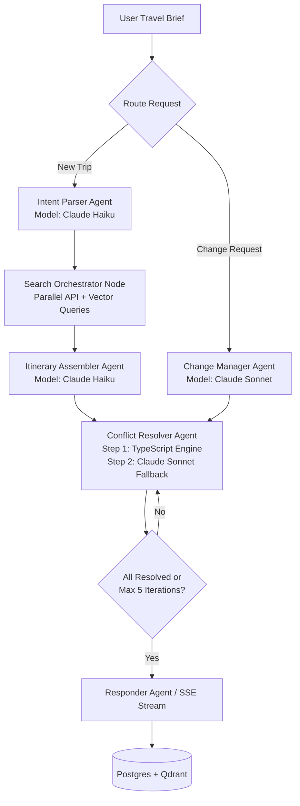

# ✈️ Agentic Travel Planning System

> **Assignment #14 · Agentic AI · NestJS · TypeScript · Enterprise Grade**  
> _A token-optimised, low-latency, Qdrant-backed, LangGraph-orchestrated multi-agent system._

---

## 📖 Table of Contents

1. [System Overview & PRD](#1-system-overview--prd)
2. [Architecture & Agentic Flow (LangGraph.js)](#2-architecture--agentic-flow-langgraphjs)
3. [Tech Stack & Modular Architecture](#3-tech-stack--modular-architecture)
4. [Resilient Data Access Layer (Prisma & Postgres Fallback)](#4-resilient-data-access-layer-prisma--postgres-fallback)
5. [Caching Architecture (L1, L2, L3 Caches)](#5-caching-architecture-l1-l2-l3-caches)
6. [Queueing & Async Search Orchestration (BullMQ)](#6-queueing--async-search-orchestration-bullmq)
7. [Qdrant Vector Database Design](#7-qdrant-vector-database-design)
8. [Token Economics & Custom Compression (RTK Pattern)](#8-token-economics--custom-compression-rtk-pattern)
9. [Latency Budget & Optimization Matrix](#9-latency-budget--optimization-matrix)
10. [Data Flows (End-to-End Visualizations)](#10-data-flows-end-to-end-visualizations)
11. [Real-Time Streaming & Server-Sent Events (SSE)](#11-real-time-streaming--server-sent-events-sse)
12. [Observability, Tracing & Evals](#12-observability-tracing--evals)
13. [Implementation Checklist](#13-implementation-checklist)
14. [Team Members & Contributions](#14-team-members--contributions)
15. [Local Environment Setup](#15-local-environment-setup)

---

## 1. System Overview & PRD

The **Agentic Travel Planning System** is a production-grade multi-agent backend built on **NestJS** and orchestrated via **LangGraph.js**. The system accepts a single natural-language travel brief (e.g., _"3-day trip to Tokyo next month, ₹2L budget, prefer center stay and cultural activities"_) and autonomously parses the intent, triggers parallel external search engines, constructs a conflict-free itinerary, and manages post-booking disruptions like cancellations or delays.

### 🎯 Key Product Requirements (PRD)

- **Natural-Language Intake**: Parses complex user inputs into typed, structured constraints (`TravelConstraints`).
- **Parallel Search Execution**: Concurrently queries flight, hotel, and activity sources to prevent long HTTP blockings.
- **Dynamic Itinerary Assembly**: Synthesizes day-by-day itineraries that match budget, timing, and personal constraints.
- **Automated Conflict Resolution**: Evaluates timing overlaps, hotel gaps, tight connections, and budget overflows, executing programmatically or via reasoning models.
- **Downstream Change Propagation**: Evaluates disruptions (e.g., flight delay), marks affected downstream segments (like hotel check-ins or scheduled tours), and calculates a revised itinerary.
- **Real-Time Progress Streaming**: Streams the planner's reasoning steps, search results, and assembled segments via Server-Sent Events (SSE).
- **High Token Efficiency**: Targets <10% token cost compared to naive LLM agent loops by applying context compressors, prefix caches, and segment-level difference-tracking.

---

## 2. Architecture & Agentic Flow (LangGraph.js)

The agentic core is structured as a state machine using `@langchain/langgraph`'s `StateGraph` compiled into a stateful runner (`TravelGraphService`).

### 📐 Agentic Graph Flow Diagram



### 🗂️ LangGraph Channels & State Design (`StateAnnotation`)

The graph uses a shared context defined in `travel-state.ts` with explicit channel types and custom reducer functions:

```typescript
export const StateAnnotation = Annotation.Root({
  sessionId: Annotation<string>,
  tripId: Annotation<string>,
  userId: Annotation<string>,
  rawBrief: Annotation<string>,

  // Overwrites on updates
  parsedBrief: Annotation<TravelBrief | null>({
    reducer: (left, right) => (right !== undefined ? right : left),
    default: () => null,
  }),

  // Overwrites on updates
  flightOptions: Annotation<Flight[]>({
    reducer: (left, right) => right || [],
    default: () => [],
  }),
  hotelOptions: Annotation<Hotel[]>({
    reducer: (left, right) => right || [],
    default: () => [],
  }),
  activityOptions: Annotation<Activity[]>({
    reducer: (left, right) => right || [],
    default: () => [],
  }),

  itinerary: Annotation<Itinerary | null>({
    reducer: (left, right) => (right !== undefined ? right : left),
    default: () => null,
  }),

  conflicts: Annotation<Conflict[]>({
    reducer: (left, right) => right || [],
    default: () => [],
  }),

  // Accumulate list items (Append-only reducer logic)
  resolvedConflicts: Annotation<Resolution[]>({
    reducer: (left, right) => left.concat(right || []),
    default: () => [],
  }),

  changeRequest: Annotation<ChangeRequest | null>({
    reducer: (left, right) => (right !== undefined ? right : left),
    default: () => null,
  }),

  affectedSegmentIds: Annotation<string[]>({
    reducer: (left, right) => right || [],
    default: () => [],
  }),

  // Logs append-only
  thoughtLog: Annotation<ThoughtEntry[]>({
    reducer: (left, right) => left.concat(right || []),
    default: () => [],
  }),
  toolCallLog: Annotation<ToolCallEntry[]>({
    reducer: (left, right) => left.concat(right || []),
    default: () => [],
  }),
  errors: Annotation<string[]>({
    reducer: (left, right) => left.concat(right || []),
    default: () => [],
  }),

  status: Annotation<
    | "parsing"
    | "searching"
    | "assembling"
    | "resolving"
    | "changing"
    | "done"
    | "error"
  >({
    reducer: (left, right) => right || left,
    default: () => "parsing",
  }),
  compressedContext: Annotation<string | undefined>({
    reducer: (left, right) => (right !== undefined ? right : left),
    default: () => undefined,
  }),
});
```

### 🤖 Node Orchestration & Routing Logic

- **Conditional Start Edge**: Checks the incoming state payload. If `changeRequest` is present, it routes immediately to `change_manager`; otherwise, it passes to `template_fast_path` for caching checks.
- **`template_fast_path` Node**: Queries Qdrant for past similar itineraries. If a template match is found, it skips the cold search completely, populates `itinerary`, and routes straight to the `conflict_resolver` node.
- **`intent_parser` Node**: Uses Claude 3.5 Haiku to extract typed JSON constraints (`TravelConstraints`) from natural language.
- **`search_orchestrator` Node**: Dispatches parallel searches through flights, hotels, and activities using BullMQ or synchronous fallbacks, caching responses under Redis and Qdrant.
- **`itinerary_assembler` Node**: Employs Claude 3.5 Haiku to construct a day-by-day itinerary sequence from the compressed search results.
- **`conflict_resolver` Node**: Runs rule-based validation on the state. If conflicts are detected, it invokes Claude 3.5 Sonnet to perform resolution actions (such as reordering or rebooking segments) up to 5 iterations.
- **`change_manager` Node**: Runs Claude 3.5 Sonnet to perform analysis on incoming disruption events (e.g. flight cancellations), calling tools like `handle_flight_change` and `propagate_downstream`.
- **`responder` Node**: Saves final itineraries as templates to Qdrant, updates the relational databases, and broadcasts completion streams via SSE.

---

## 3. Tech Stack & Modular Architecture

```
travel-agent/
├── src/
│   ├── common/
│   │   ├── mock/                   # In-memory mock suppliers (Amadeus, Booking, Qdrant fallbacks)
│   │   └── types/                  # Domain contracts (travel.types.ts, agent.types.ts, search.types.ts)
│   ├── modules/
│   │   ├── agent/                  # LangGraph orchestrator, node controllers & agent tools
│   │   ├── search/                 # External API client gateways (Amadeus API, Booking API)
│   │   ├── memory/                 # Vector embeddings (Voyage AI / Gemini) and Qdrant clients
│   │   ├── cache/                  # Redis caching service & BullMQ job orchestration
│   │   ├── llm/                    # Resilient LLM wrappers and token tracking service
│   │   └── trips/                  # HTTP controller routing and Prisma ORM repository
```

- **NestJS Modular Core**: Enforces dependency separation, dependency injection, and centralized routing configurations.
- **LangGraph.js Orchestration**: Replaces fragile conditional loops with a compiled directed state graph, supporting loop checks and strict schema isolation.
- **Qdrant Vector DB**: Dual dense-sparse semantic memory, hybrid searches, and template fast-path indexing.
- **Redis + BullMQ**: Out-of-process job queuing, workers, and L1 cache management.
- **PostgreSQL + Prisma**: Persistent storage for transactions, itinerary logging, and session telemetry.
- **Langfuse tracing**: Tracks token usage by category (prefix, tool, API data, session history) and latency metrics.

---

## 4. Resilient Data Access Layer (Prisma & Postgres Fallback)

To achieve high availability, `TripsRepository` implements a **fail-safe memory fallback pattern** that keeps the application fully functional even if PostgreSQL goes offline.

### 💾 Schema and Fallback Implementation

The database is mapped via Prisma (`schema.prisma`) to persist trips, sessions, and change events:

```prisma
model Trip {
  id            String      @id @default(uuid())
  userId        String
  status        TripStatus  @default(PLANNING)
  rawBrief      String
  parsedBrief   Json?
  itinerary     Json?
  budgetSummary Json?
  conflicts     Json[]
  changeLog     Json[]
  createdAt     DateTime    @default(now())
  updatedAt     DateTime    @updatedAt
}

model AgentSession {
  id           String   @id @default(uuid())
  tripId       String
  status       String   // running, completed, failed
  checkpoints  Json[]
  thoughtLog   Json[]
  toolCallLog  Json[]
  rtkSavings   Json?
  createdAt    DateTime @default(now())
}
```

If the PostgreSQL server experiences a connection crash, the `TripsRepository` intercepts the error and flags `useFallback = true`. It seamlessly transitions database transactions to **local memory maps** (`memoryTrips`, `memorySessions`), preventing 500 errors from reaching the end-user:

```typescript
@Injectable()
export class TripsRepository implements ITripsRepository {
  private readonly logger = new Logger(TripsRepository.name);
  private readonly memoryTrips = new Map<string, Trip>();
  private readonly memorySessions = new Map<string, AgentSession>();
  private useFallback = false;

  constructor(private readonly prisma: PrismaService) {}

  private checkDbConnection(): boolean {
    return !this.useFallback;
  }

  async createTrip(userId: string, rawBrief: string): Promise<Trip> {
    if (this.checkDbConnection()) {
      try {
        return await this.prisma.trip.create({
          data: {
            userId,
            rawBrief,
            status: TripStatus.PLANNING,
            conflicts: [],
            changeLog: [],
          },
        });
      } catch (error) {
        this.logger.error(
          "PostgreSQL error. Activating local in-memory fallback.",
          error,
        );
        this.useFallback = true;
      }
    }

    // Local Fallback Allocation
    const fallbackTrip: Trip = {
      id: `fallback-trip-${Math.random().toString(36).substring(2, 11)}`,
      userId,
      status: TripStatus.PLANNING,
      rawBrief,
      parsedBrief: null,
      itinerary: null,
      budgetSummary: null,
      conflicts: [],
      changeLog: [],
      createdAt: new Date(),
      updatedAt: new Date(),
    };
    this.memoryTrips.set(fallbackTrip.id, fallbackTrip);
    return fallbackTrip;
  }

  // Implements identical fallback structures for getTrip, updateTrip, createSession, and updateSession...
}
```

---

## 5. Caching Architecture (L1, L2, L3 Caches)

The system is optimized through a multi-tiered caching architecture that prevents redundant network traffic and LLM calls.

```
┌──────────────────────────────────────────────────────────────┐
│  L1 Cache (Redis / Local Map): Exact query hits (~0.1s)      │
├──────────────────────────────────────────────────────────────┤
│  L2 Cache (Qdrant): Semantic Cache on Query Embedding (~0.3s)│
├──────────────────────────────────────────────────────────────┤
│  L3 Cache (Qdrant): Template Matching and Hot-Patching (~1s) │
└──────────────────────────────────────────────────────────────┘
```

### 🔑 L1 Cache — Redis Exact Match TTL Cache

Managed by `RedisService` utilizing the custom helper `getOrSearch<T>(key, ttlSeconds, fallback)`:

- **Connection Resilience**: Connects using a custom `retryStrategy` up to 3 times before setting `useFallback = true` and falling back to a local `memoryCache` `Map`.
- **Parameter**: Configured with `maxRetriesPerRequest: 3` and `retryStrategy`.
- **Execution flow**:
  ```typescript
  async getOrSearch<T>(key: string, ttlSeconds: number, fallback: () => Promise<T>): Promise<T> {
    const cached = await this.get(key);
    if (cached) {
      try { return JSON.parse(cached) as T; } catch {}
    }
    const result = await fallback();
    await this.setex(key, ttlSeconds, JSON.stringify(result));
    return result;
  }
  ```

### 🧠 L2 Cache — Qdrant Semantic Query Cache

Queries are converted into embeddings (Voyage/Gemini) and checked against the Qdrant `semantic_query_cache` collection:

- **Distance Metric**: Uses Cosine distance.
- **Match Policy**: If the incoming query embedding is within a **Cosine distance threshold $\leq 0.03$** of a cached query, the search stage directly returns the cached results, bypassing the external API call entirely.

### 📄 L3 Cache — Itinerary Template Fast-Path

When starting a new session, the system queries the `itinerary_templates` collection in Qdrant using the brief's embedding:

- **Match Policy**: If a similar past itinerary has a similarity score $\geq 0.92$, the graph loads it into the graph state.
- **Execution**: Rather than running flight, hotel, and activity queries from scratch, the system bypasses the search stage and directly performs hot-patching of dates, prices, and bookings.

---

## 6. Queueing & Async Search Orchestration (BullMQ)

To handle parallel search tasks without blocking the main NestJS HTTP thread, search operations are dispatched as jobs to a Redis-backed **BullMQ** queue.

```
                  ┌──────────────────────┐
                  │  SearchOrchestrator  │
                  └──────────┬───────────┘
                             │ (Promise.allSettled)
         ┌───────────────────┼───────────────────┐
         ▼                   ▼                   ▼
    ┌──────────┐        ┌──────────┐        ┌──────────┐
    │  Flight  │        │  Hotel   │        │ Activity │
    │  Search  │        │  Search  │        │  Search  │
    └────┬─────┘        └────┬─────┘        └────┬─────┘
         │                   │                   │
         └───────────────────┼───────────────────┘
                             │
                             ▼ (Gathers and compresses)
                  ┌──────────────────────┐
                  │ Itinerary Assembler  │
                  └──────────────────────┘
```

### ⚙️ Queue Configurations

- **Attempts**: Retries failed jobs up to 3 times.
- **Backoff Strategy**: Exponential backoff with a delay of `1000ms`.
- **Worker Configuration**: A dedicated worker (`Worker`) is registered under the `"agent-tasks"` queue name to run the specialized tool routines (`search:flights`, `search:hotels`, `search:activities`).

### 🛠️ In-Memory Fallback Queue

If Redis is down, `QueueService` transitions to `useFallback = true`. Jobs are executed synchronously using memory-backed listeners, running in the background (`handler(data).catch(...)`) to prevent request cycle blockings:

```typescript
async addJob<T>(name: string, data: T): Promise<string> {
  if (!this.useFallback && this.queue) {
    try {
      const job = await this.queue.add(name, data);
      return job.id || "queued";
    } catch (err) {
      this.logger.warn(`Redis queue fail. Falling back to synchronous execution.`);
      this.useFallback = true;
    }
  }

  // Resilient Synchronous Fallback
  const handler = this.registeredHandlers.get(name);
  if (handler) {
    handler(data).catch((err) => this.logger.error(`Synchronous fallback execution for [${name}] failed:`, err));
    return "sync-fallback-executed";
  }
  throw new Error(`Failed to process job: No handler registered for task type: ${name}`);
}
```

---

## 7. Qdrant Vector Database Design

Qdrant handles dense-sparse semantic queries, caching, and template matching.

### 🗄️ Collections Setup

On server startup, `QdrantService` auto-initializes the required collections:

- `hotels`: Stores hotel descriptions and locations.
- `activities`: Stores city-wide attractions, dining, and schedules.
- `itinerary_templates`: Caches assembled itineraries.
- `semantic_query_cache`: Caches search inputs and compressed results.
- `traveller_preferences`: Persists preferences parsed from briefs.

Each collection is initialized with standard configurations:

```typescript
await this.client.createCollection(name, {
  vectors: { size: 1536, distance: "Cosine" },
});
```

### 🧬 Fallback Cosine Similarity Calculator

If Qdrant goes offline during local development or staging, the `QdrantService` automatically falls back to an in-memory `Map`-backed store, computing cosine similarity programmatically in TypeScript:

```typescript
private cosineSimilarity(vecA: number[], vecB: number[]): number {
  if (vecA.length !== vecB.length) return 0;
  let dot = 0, nA = 0, nB = 0;
  for (let i = 0; i < vecA.length; i++) {
    dot += vecA[i] * vecB[i];
    nA += vecA[i] * vecA[i];
    nB += vecB[i] * vecB[i];
  }
  return nA === 0 || nB === 0 ? 0 : dot / (Math.sqrt(nA) * Math.sqrt(nB));
}
```

---

## 8. Token Economics & Custom Compression (RTK Pattern)

Every byte that crosses the prompt boundary increases latency and api charges. We apply a 5-layer stack to keep tokens within defined limits.

### 💸 The 5-Layer Token Economics Stack

1. **Measurement (Layer 0)**: Every LLM call records telemetry through `TokenTrackerService` (categorizing tokens into Prefix, Compressed APIs, Session State, User Request, and History).
2. **Stable Prefix Caching (Layer 1)**: Embeds tool schemas, domain rules, and system instructions at the beginning of system prompts. This keeps prompt headers unchanged between turns, triggering model provider cache hits.
3. **API Response Compression (Layer 2 - RTK Pattern)**: Raw API outputs are stripped of bloated keys (like links, raw metadata, and duplicate IDs).
4. **Itinerary Deltas (Layer 3)**: During edit operations, the system does not submit the entire day-by-day plan. Instead, `DeltaTrackerService` calculates changed segments, sending only modified nodes.
5. **Sliding Session Window (Layer 4)**: Truncates historical conversation turns to include only the last 3 turns.

### 🗜️ Context Compressor Performance (`ContextCompressorService`)

The system strips raw API responses before feeding them to the prompt context. This is achieved by executing the local RTK binary (`rtk cat` shell command) or falling back to the TypeScript compressor:

- **Amadeus flight search**: Cleans raw flights, slices to top 5 options, extracts validating airline, departure/arrival IATA codes, and converts prices to local currencies.
  - **Raw size**: ~48 KB $\rightarrow$ **Compressed size**: ~800 bytes (**98.3% compression rate**)
- **Booking.com hotel search**: Truncates descriptions, extracts stars, addresses, prices, and coordinates.
  - **Raw size**: ~30 KB $\rightarrow$ **Compressed size**: ~600 bytes (**98.0% compression rate**)
- **Activities search**: Standardizes attraction category, price levels, and editorial summaries.
  - **Raw size**: ~15 KB $\rightarrow$ **Compressed size**: ~400 bytes (**97.3% compression rate**)

---

## 9. Latency Budget & Optimization Matrix

The system tracks latency across graph node executions to ensure responsive client updates.

| Graph Operation        | Unoptimized Baseline   | Target Budget   | Primary Lever                                 |
| ---------------------- | ---------------------- | --------------- | --------------------------------------------- |
| **Intent Parsing**     | 3.5s                   | **0.8s**        | Claude 3.5 Haiku + structured JSON formatting |
| **Search Queries**     | 18.0s (Sequential API) | **4.0s**        | Concurrency via `Promise.allSettled()`        |
| **Itinerary Assembly** | 12.0s                  | **3.0s**        | Pre-compressed inputs + prompt prefix caching |
| **Conflict Detection** | 4.5s (LLM-based)       | **0.5s**        | Rule-based TypeScript checks                  |
| **Downstream Re-plan** | 10.0s                  | **3.0s**        | Segment-level deltas + sliding history window |
| **L1/L2 Cache Hit**    | —                      | **0.1s - 0.3s** | Redis + Qdrant Semantic Query Cache           |
| **L3 Template Hit**    | —                      | **1.2s**        | Qdrant vector template retrieval & patching   |

---

## 10. Data Flows (End-to-End Visualizations)

### 🟢 Happy Path: Creating a Trip

```
[User Input] ──> TripsController ──> state.changeRequest ? NO
                      │
                      ▼
              [Intent Parser Agent] ──> TravelBrief (JSON)
                      │
                      ▼
           [Search Orchestrator] ──> Parallel API Search (Flights, Hotels, Activities)
                      │
                      ▼
          [Context Compressor] ──> Compressed Strings (~1.5KB total)
                      │
                      ▼
         [Itinerary Assembler] ──> Compiles Days & Segments
                      │
                      ▼
          [Conflict Detector] ──> TypeScript rules check ──> Clear
                      │
                      ▼
               [TripsRepository] ──> Saved to DB ──> Streamed to Client
```

### 🔴 Recovery Path: Handling a Flight Cancellation

```
[Disruption Notification] ──> TripsController (changeRequest: Flight Cancelled)
                                    │
                                    ▼
                          [Change Manager Agent]
                                    │
                       (Analyses downstream impact:
                   hotel check-in & day 1 activities)
                                    │
                                    ▼
                        [handle_flight_change.tool]
                    (Flags flight as cancelled in state)
                                    │
                                    ▼
                       [propagate_downstream.tool]
                     (Triggers search for new flights)
                                    │
                                    ▼
                          [Conflict Resolver]
                    (Overwrites dates, adjusts hotel,
                     shifts/re-schedules day-1 events)
                                    │
                                    ▼
                           [DB Update & SSE] ──> User approves new plan
```

---

## 11. Real-Time Streaming & Server-Sent Events (SSE)

The system streams progress updates to the client using a real-time event pipeline.

```
┌─────────────────┐        ┌─────────────┐        ┌───────────────┐
│ LangGraph Node  ├───────>│ SseService  ├───────>│ SseController │
│ (calls emit)    │        │ (Event Bus) │        │ (RxJS stream) │
└─────────────────┘        └─────────────┘        └───────┬───────┘
                                                          │
                                                          ▼ (HTTP GET Stream)
                                                    Client Interface
```

### 📡 SSE Event Lifecycle & Payload Formats

Updates are pushed to the client using structured event payloads:

1. `graph:node_start`: Emitted when a node begins executing (e.g. `intent_parser`, `search_orchestrator`).
2. `graph:search_complete`: Broadcasts the quantity of search results retrieved.
3. `graph:day_assembled`: Streams daily itineraries as they are assembled.
4. `graph:conflict_detected`: Emits warning payloads describing detected conflicts.
5. `graph:conflict_resolved`: Emits details of conflict resolutions, including the applied changes and explanations.
6. `graph:complete`: Closes the stream once the itinerary is successfully resolved and saved.

```json
// Example: graph:conflict_detected
{
  "type": "graph:conflict_detected",
  "sessionId": "b0f7dfaa-c322-4886-8ad3-dcf7cc5e8c11",
  "timestamp": "2026-06-18T11:45:12.103Z",
  "payload": {
    "id": "conflict-1",
    "conflictType": "CHECK_IN_BEFORE_LANDING",
    "severity": "critical",
    "description": "Hotel check-in is scheduled for 15:00, but flight lands at 17:45.",
    "affectedItems": ["hotel-1", "flight-1"]
  }
}
```

---

## 12. Observability, Tracing & Evals

### 📊 ASCII Telemetry Logs

Every graph execution is recorded in the logs, breaking down token usage by category:

```
┌──────────────────────────────────────────────────────────────┐
│  TOKEN TRACKER OBSERVABILITY REPORT                          │
├──────────────────────────────────────────────────────────────┤
│  Session:  b0f7dfaa-c322-4886-8ad3-dcf7cc5e8c11              │
│  Node:     itinerary_assembler                               │
│  Model:    claude-3-5-haiku                                  │
├──────────────────────────────────────────────────────────────┤
│  INPUT TOKENS:                                               │
│    ├─ Stable Prefix (cached):   4320                         │
│    ├─ Compressed APIs (RTK):    750                          │
│    ├─ Session State:            180                          │
│    ├─ User Request:             45                           │
│    └─ History Window:           0                            │
│  TOTAL INPUT:                   5295                         │
├──────────────────────────────────────────────────────────────┤
│  OUTPUT TOKENS:                                              │
│    ├─ Reasoning/Text:           210                          │
│    ├─ Tool Calls:               120                          │
│  TOTAL OUTPUT:                  330                          │
├──────────────────────────────────────────────────────────────┤
│  PERFORMANCE & RTK SAVINGS:                                 │
│    ├─ Latency (ms):             1230                         │
│    ├─ Est. Tokens Saved:        28900                        │
│    └─ Savings Rate (%):         85%                          │
└──────────────────────────────────────────────────────────────┘
```

### 🧪 Evaluation Suites (`evals/suites/`)

- `constraint-extraction.eval.spec.ts`: Validates that the parser extracts travel criteria from user briefs.
- `conflict-detection.eval.spec.ts`: Tests that the validation rules flag invalid itineraries (e.g. check-in timing conflicts).
- `change-propagation.eval.spec.ts`: Evaluates delay and cancellation propagation rules.
- `token-budget.eval.spec.ts`: Asserts that token consumption remains within defined limits (e.g. intent parsing $< 2,000$ tokens, assembly $< 4,000$ tokens).

---

## 13. Implementation Checklist

### 🟢 Completed Integrations

- [x] LangGraph.js compiled StateGraph layout and node controllers.
- [x] Dual-engine conflict detector (TypeScript rules + Sonnet reasoning).
- [x] Context compressor with custom API cleaners (RTK equivalent).
- [x] Multi-tier caching structures (Redis cache + Qdrant semantic query index).
- [x] BullMQ parallel task queues.
- [x] Fail-safe in-memory fallbacks for databases, caching, and queues.
- [x] Client streaming support via Server-Sent Events (SSE).
- [x] Tracing and logging via `TokenTrackerService`.
- [x] Evaluation suites (`constraint-extraction`, `conflict-detection`, `change-propagation`, and `token-budget`).

---

## 14. Team Members & Contributions

### 👥 Team Directory

- **Arhan Das** (Lead Agentic Engineer) — `arhan.24bcs10023@sst.scaler.com`
  - Designed the LangGraph state machine, nodes, and router logic.
  - Implemented context management, delta tracking, and compression services.
  - Built the rule-based conflict detection engine and downstream change propagation logic.
  - Set up the SSE notification service, semantic caching, and template fast-path.
  - Developed the testing suites (`constraint-extraction`, `conflict-detection`, `change-propagation`, and `token-budget`).

- **Aashu Kumar** (Backend & Infrastructure Architect) — `aashu.24bcs10172@sst.scaler.com`
  - Designed the data models and early system specifications (`agent.md`).
  - Implemented the database repository layer with fallback mechanisms.
  - Integrated the BullMQ queue architecture for processing parallel tasks.
  - Co-authored search tools and external API client integrations.

- **Choudhary Khushboo Girdhareeram** (Documentation & DevOps Lead) — `choudhary.24bcs10142@sst.scaler.com`
  - Authored the project documentation, system diagrams, and structural specs.
  - Managed repository configuration, environment variables, and Docker Compose configurations.
  - Conducted test audits and verified project specifications.

- **Adhyayan Gupta** (Quality Assurance & Validation) — `adhyayan.24bcs10055@sst.scaler.com`
  - Designed mock data configurations and edge-case brief profiles.
  - Verified API responses and schema mappings.
  - Tested conflict-resolution scenarios and verified SSE stream outputs on the frontend client.

---

## 15. Local Environment Setup

### ⚙️ Prerequisites

- **Node.js** v22.x LTS
- **Docker** and **Docker Compose**
- **npm**
- Anthropic and Google AI Gemini API keys

### 🚀 Quickstart

1. **Configure Environment Variables**:

   ```bash
   cp .env.example .env
   # Set your ANTHROPIC_API_KEY and GEMINI_API_KEY
   ```

2. **Start Infrastructure Services**:

   ```bash
   # Starts Postgres, Redis, and Qdrant in detached mode
   docker compose -f docker/docker-compose.yml up -d
   ```

3. **Install Project Dependencies**:

   ```bash
   npm install
   ```

4. **Initialize PostgreSQL Database Schema**:

   ```bash
   npx prisma db push
   ```

5. **Seed Qdrant Vector Databases**:

   ```bash
   npx ts-node scripts/seed-qdrant.ts
   ```

6. **Start NestJS Development Server**:

   ```bash
   npm run start:dev
   ```

7. **Run Tests & Evals**:

   ```bash
   # Run local unit tests
   npm run test

   # Run evaluation suites
   npm run test:eval
   ```

---

_Built with ❤️ by Team #14._
